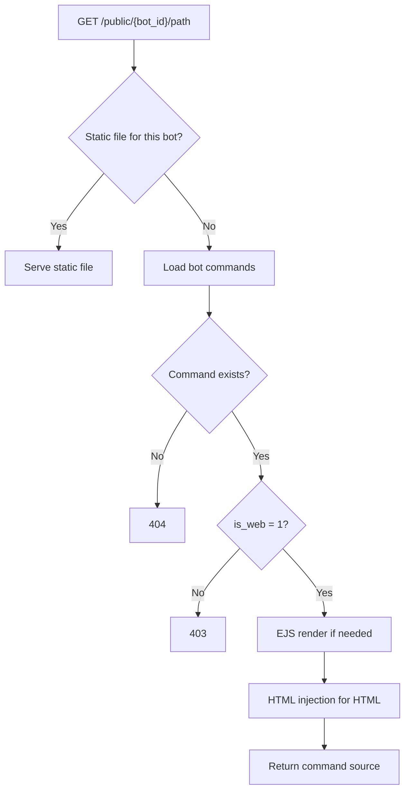

# Public Web

**Public web** serves static and semi-static bot content directly to browsers — landing pages, CSS, JS, and HTML templates — **without running the TBL sandbox**.

It is the fastest way to host marketing pages, documentation sites, and front-end assets tied to your bot project.

---

## How it differs from Webapp

| | Public web | Webapp |
| --- | --- | --- |
| **Route** | `/public/{bot_id}/{path}` | `/webapp/{bot_id}/{command}` |
| **Runs TBL sandbox** | **No** | Yes |
| **`res`, `Api`, `db`, `HTTP`** | **Not available** | Available |
| **Command flag** | **`is_web = 1` required** | Any command |
| **What is served** | Raw command `code` (+ EJS if `<%`) | Script execution output via `res` |
| **Use case** | Static HTML, CSS, JS, assets | Dynamic APIs, DB-backed pages |

Public web is **not** a replacement for webapps when you need database access or `res.json()`. It is a **static file server** backed by your bot's command files.

---

## URL format

Per-bot public URLs:

```
https://{domain}/public/{bot_id}/{path}?{queryParams}
```

Generate links with:

```js
Webapp.getUrl("index.html", { public: true })
Webapp.getUrl("styles/main.css", { public: true })
Webapp.getUrl({ command: "about", public: true, params: { lang: "en" } })
```

`Webapp.getUrl()` builds the correct URL for your bot automatically.

---

## Enabling a command for public web

A command must be marked **`is_web = 1`** in your bot project. Commands without this flag return **403**:

```json
{
  "status": "error",
  "message": "Access denied: Not a public web resource"
}
```

Only expose files you intend to be world-readable.

---

## Request handling flow



### 1. Static files

If your bot has a matching static file for the requested path, it is served directly with the correct MIME type.

### 2. Virtual command matching

If no static file matches, the platform looks up a bot command by:

1. Exact path (e.g. `about.html`)
2. Case-insensitive name
3. Aliases
4. Default: empty path → `index.html`; aliases `index`, `app`

### 3. Serve command source

The command's **source code** is returned as the response body. **No TBL script execution** — `Api.sendMessage()`, `db.get()`, and `res.json()` do not run.

---

## What you can use in public web commands

| Feature | Available |
| --- | --- |
| EJS templates (`<%`, `<%=`) | Yes — limited context |
| HTML injection (`<base>`, meta tag) | Yes for HTML |
| HTML age-gate protection | Yes |
| Query params in templates | Yes — via `params` / `request.query` |
| `bot` in templates | Yes — `{ id, username, name }` |
| `user` | **No** — always absent |
| `Api`, `db`, `HTTP`, `res` | **No** |

### Template context (public web)

| Variable | Description |
| --- | --- |
| `bot` | `{ id, bot_id, username, name }` |
| `params` | URL query parameters |
| `request` | `{ url, method, query, headers }` |
| `owner`, `user`, `chat` | `null` |

Example `index.html` command with EJS:

```html
<!DOCTYPE html>
<html>
<head>
  <title><%= bot.username %> — Home</title>
</head>
<body>
  <h1>Welcome to @<%= bot.username %></h1>
  <% if (params.promo) { %>
    <p>Promo: <%= params.promo %></p>
  <% } %>
</body>
</html>
```

---

## Supported file types

MIME type is inferred from the command name extension:

| Extension | Content-Type |
| --- | --- |
| `.html`, `.htm` | `text/html` |
| `.css` | `text/css` |
| `.js`, `.mjs` | `application/javascript` |
| `.json` | `application/json` |
| `.xml` | `application/xml` |
| `.svg` | `image/svg+xml` |
| `.ico` | `image/x-icon` |
| Other | `text/plain` |

---

## Relative assets and `<base href>`

For HTML responses, the platform injects a per-bot base path:

```html
<base href="/public/{bot_id}/">
```

Add CSS/JS as separate `is_web` commands and reference them relatively:

```html
<link rel="stylesheet" href="styles.css">
<script src="app.js"></script>
```

Generate asset URLs with `Webapp.getUrl("styles.css", { public: true })`.

---

## Rate limits

Public web shares the same per-bot plan limits as webhooks and webapps:

| Plan | Per minute | Per day |
| --- | --- | --- |
| FREE | 15 | 5,000 |
| FREEMIUM | 30 | 5,000 |
| PREMIUM | 60 | 10,000 |
| ELITE | 120 | 20,000 |

Exceeded limits return **429**.

---

## When to use public web

| Use public web | Use webapp instead |
| --- | --- |
| Marketing landing page | API that reads `db` |
| Static CSS/JS bundle | Server logic with `HTTP` |
| HTML with light EJS (bot name, query params) | `res.render()` pipeline |
| Fast CDN-like delivery | Authenticated admin panel |

| Use public web | Use webhook instead |
| --- | --- |
| Anonymous page views | Signed per-user action |
| No server-side secrets | Payment callback with user context |

---

## Common patterns

### Landing + dynamic app

1. **Public web** — `index.html` (`is_web=1`) for marketing shell
2. **Webapp** — `api/data` for JSON the page fetches client-side
3. **Webhook** — signed links for user-specific actions from the page

### Default home page

Create a command named `index.html` (or alias `index` / `app`) with `is_web=1`:

```
https://{domain}/public/{bot_id}/
```

Empty path resolves to `index.html`.

---

## Errors

| Status | Meaning |
| --- | --- |
| 400 | Missing `bot_id` |
| 403 | Bot blocked or `is_web !== 1` |
| 404 | Bot not found or path not matched |
| 429 | Rate limit exceeded |
| 500 | Template render error |

---

## See also

- [Webapp Methods](webapp-methods.md) — `public: true` on `getUrl`
- [Webapps overview](index.md)
- [HTML & EJS](../res-instance/html-and-ejs.md) — EJS in sandbox webapp/webhook (with full `res`)
- [Limits & Security](../webhook-instance/limits-and-security.md)
